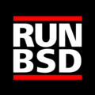

# Berkeley Software Distribution (<dfn title="Berkeley Software Distribution">BSD</dfn>)

This line of operating systems started out life as a series of
patches to AT&T UNIX which was introduced to the University of
Berkeley by Ken Thompson whilst on sabbatical in 1977.

The development of BSD is closely tied with that of the internet.
BSD's modern variants are some of the oldest communities who have
collaborated over the internet to develop a software project which
continues to today. The workflow of the projects has transpired to
become the standard way of developing open source software on the
internet, whether it's
[adhering to a style guide](https://en.wikipedia.org/wiki/Kernel_Normal_Form),
[developing with a publicly accessible source repository](https://en.wikipedia.org/wiki/OpenBSD#Open-source_and_open_documentation), or
[holding a hackathon](https://en.wikipedia.org/wiki/Hackathon#Origin_and_history).

For a newcomer interested in an operating system to run on your
hardware, it is a great opportunity to be a part of a tech savvy
community working to evolve an idea started almost 40 years ago.

As a business, each project produces a mature and robust operating
system that has seen many applications from running on devices such
as
[game consoles](https://en.wikipedia.org/wiki/PlayStation_4_system_software),
[mobile phones](http://undeadly.org/cgi?action=article&sid=20140506132000),
[cars](http://imgur.com/a/SMVdp),
[satellites and the international space station](https://en.wikipedia.org/wiki/NetBSD#Examples_of_use).
Nearly all projects are backed by a non-profit foundation which can
act as a liaison for businesses and assist with enquiries regarding
development.

You'll find the various [BSD's](bsd.html) listed on the side menu in
chronological order, starting from the [oldest](bsd.html) to the
[newest](dragonfly.html). All but the original BSD project are actively
developed.

## Media kit

Thanks to [@FiLiS](https://twitter.com/FiLiS) for the logo.

<pre>

<a href="favicon.png">favicon  32x32</a>
<a href="avatar.png">avatar 120x120</a>
<a href="logo.png">logo 2800x2800</a>

</pre>
