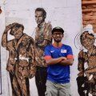

# Adli Wahid runs BSD

I am Adli and currently work as a Senior Internet Security Specialist at
[APNIC](https://www.apnic.net).

My first job was at a public university in Malaysia.  Other than
teaching and the libary (I'm a bookworm!), the best part about being in
an university environment (late 90s --- early 00) was having access to
the Internet and spare hardware.  Back then we still had many commercial
Unix systems (HP-UX, SunOS, AIX, SGIX) on campus, but I remember some
friends in the computing centre started experimenting with Linux.  I
joined the bandwagon --- removing Windows from the desktop then laptops
and replacing them with RedHat Linux.  Overtime I also used Slackware,
Debian, Mandrake, and Ubuntu and did a couple of install-fest on campus
for both students and lecturers.

At about the same time I started to hear about
[FreeBSD](https://www.freebsd.org) and
[OpenBSD](https://www.openbsd.org) from a couple of mailing lists and
forums.  Eventually the opportunity to use BSD came about when I managed
to convince the university computer center to let me set up the web and
mail server for the faculty.  Everything was centralised and I was not a
full-time system administrator, so this was a big deal :-) I should also
give a shout out to Matt Simerson's for putting together the [Qmail
toaster
script](https://matt.simerson.net/computing/mail/toaster/changelog.shtml)
that I used for the mail server.

I started using OpenBSD for my UltraSparc64 workstation perhaps sometime
in 2003.  That made me fell in love with it mainly because of the
simplicity, low resources requirement and the focus on security.  I
ventured into setting up a couple of webservers and used pf for
firewalling wherever I can.  These days I still managed some OpenBSD
servers --- including the host for my personal blog.

Oh yes, I also  must mention that I purchased the [OpenBSD 3.6
CD](https://www.openbsd.org/36.html) from Theo who came to Kuala Lumpur
to speak at the
[HackinTheBox2004](http://conference.hackinthebox.org/hitbsecconf2004/speakers.php.html)

You can find me on [Twitter](https://www.twitter.com/adliwahid) and
[Mastodon](https://bsd.network/@adliwahid). I also occasionally write
on [my personal site](https://durian.fsck.my).

_[6 Jul 2019](/raw/people/adli.md)_
