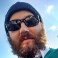

# Andreas Drewke runs BSD

Hi, I am Andreas Drewke (andreasdr) from Berlin/Germany and a happy BSD
user.  My story is not like straight ahead maybe but still very BSD
related.

My first contact with BSD was in 2004 I guess, since I discovered NetBSD
at this time, after playing around with Linux and BeOS.  It was
approximatly the 2.0 release.  I loved its performance, the clean design
in many terms, and the userland/cli tools.  Also the geekyness.  I did
not know about [OpenBSD] but [FreeBSD].  However I was disgusted by
FreeBSDs installer this time.

I played around with NetBSD/macppc and ended up using NetBSD/i386 on my
Lenovo R40 laptop at work.  I had a contract which involved software
development with JAVA mainly and some CSS/HTML and Lotus Notes/Domino :D
I even had Lotus Notes/Domino via Wine running on this laptop.  It was a
lot of fun!  Somewhere I have a evidence screenshot :D I ran this setup
for 2 years until my NetBSD got broken.

Later on I did a 3 years pause regarding software development.

When coming back I bought a MacBook Pro with MacOS X which is also
similar to BSD.  I was tired of open source operating systems that
needed too much focus on fixing and setting up things instead of just
getting work done.  I still use a MacBook Pro for my jobs from time to
time, but came back to BSD in 2017.  This time it was FreeBSD.

Because then I got a very fast AMD Ryzen based machine and got my
feeling back of a real workstation PC that costs a quarter of a MacBook
Pro and outperform MacOSX significantly, I guess mainly due to better
hardware.  FreeBSD is my current OS of choice.  Large portions of my 3D
engine and our current game I am working on, were developed while using
FreeBSD.  Nobody believes it maybe, but I can tell you that FreeBSD is
faster than Linux and a lot faster than Windows 10 if it comes to giving
CPU cycles to its processes or maybe also file system and disc IO.
Believe me I have every of those OS on my machine on equal drives :DDD

FreeBSD only took like 3 hours to set it up for me and then it just
works.  One time I did manage to destroy it, but this was after 1+ years
of usage.

Unfortunatly I can not check NetBSD currently or OpenBSD as the first
lacks 3D hardware acceleration for current graphic cards and the second
has still issues with AMDGPU driver.  However FreeBSD + NVIDIA first and
later AMDGPU served me real, real great.  I am in love.  For about 2
years now.  <3 <3 <3

I could probably tell more, but thats it for now.

Oh btw. I would love to know some more BSD people (in Berlin). Anyone 
wants to start a Berlin BSD user group?

[drewke.net](http://drewke.net)

_[2019-12-26](/raw/people/andreasdr.md)_

[FreeBSD]: https://www.freebsd.org/
[OpenBSD]: https://www.openbsd.org/
