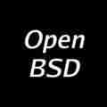

# Ander runs OpenBSD

I am 31, I earned an advanced degree in IT (something between high
school and college). I'm learning ANSI C and Math in my spare
time.

First, I began with Debian Woody in 2003.  A rough start, because
I had no documentation around (just an article from a magazine),
but I began to truly understand computers.  Thanks to the Unix-like
operating systems I had a solid ground on how actually these machines
work. And those OSes were fun, hackable, expandable.

A few years later, I tried a Live CD with [FreeSBIE]&mdash;OS based
on [FreeBSD]. It ran faster than Linux, even from the CD.  Finally,
I'd got my internet connection. First, I had read FreeBSD manuals,
and later I discovered [NetBSD] and [OpenBSD]. I was amazed.  Clear
steps to setup X, daemons easily explained, everything. No more
`/etc/sysconfig`. [pf(4)] syntax is saner than iptables, and
compat_linux(8), and it ran Opera even (proprietary, I know, but
back in the day it was preferable). I hadn't switched to BSD yet,
but I applied a lot of its philosophy on my Linux setup, it was
wonderful.  I began to like distros like Crux and its ports.  Later
I tried [DesktopBSD] 1.x, and it felt as fast as the old FreeSBIE
distro, but now it was installable.

So, with OpenBSD 5.3 all my hardware was recognized according to
[dmesg(8)]&mdash;I made my final switch.  OpenBSD is easy to install
and manage (binary ports!).  I followed [afterboot(8)] tips, before
reading the [FAQ], which exmplains all the basics. Every upcoming
release improves performance a lot and, what's more important, what
I've learned stays as is.  I realized how many years I wasted
switching operating systems, when one BSD gives me all.  All my
half-baked knowledge from now defunct Linux distros is outdated.
It's different with BSDs: all you've learned will serve you well
for years.

The tipping point for me was a complete base, great documentation,
and availability.  Linux was everywhere: in magazines, on book
covers, in libraries.  While getting a BSD distro was a matter of
luck, because for a teenager ordering CDs from outside of Europe
would've been really expensive. With broadband at home BSD was an
easy choice.

Back to OpenBSD. I run OpenBSD on my desktop PC and I do everything
on it: IT theory, homework programming exercises, pf(4) testing
under [vmm(4)]/[vmd(8)], web browsing, media playing, gaming (source
ports and emulators). Nobody would believed me in 2004, if I told
them that I am playing a Game Cube game under OpenBSD and MESA.
All of that on a low-end 4GB machine.

Now I'm getting another Advanced Degree as a developer, and all
Linux VMs run under vmm(4) with VNC for Mono Develop
IDE.

Find me on [Mastodon].

_[11 Aug 2018](/raw/people/anthk.md)_

[FreeSBIE]: http://www.freesbie.org/
[FreeBSD]: https://www.freebsd.org
[NetBSD]: https://www.netbsd.org
[DesktopBSD]: https://www.desktopbsd.net
[pf(4)]: https://man.openbsd.org/pf.4
[vmm(4)]: https://man.openbsd.org/vmm.4
[vmd(8)]: https://man.openbsd.org/vmd.8
[dmesg(8)]: https://man.openbsd.org/dmesg.8
[afterboot(8)]: https://man.openbsd.org/afterboot.8
[OpenBSD]: https://www.openbsd.org
[FAQ]: https://www.openbsd.org/faq/
[Mastodon]: https://bsd.network/@anthk
