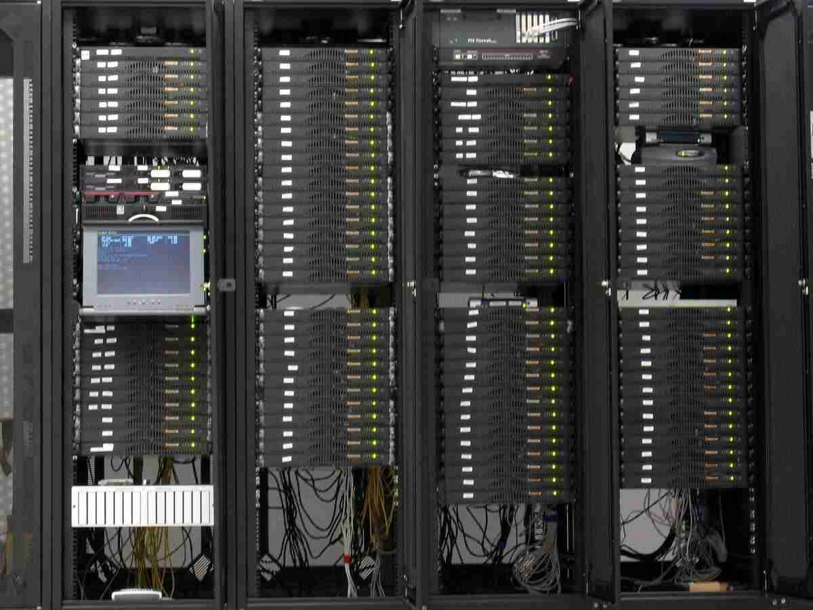

# Noah Axon runs OpenBSD

I'm Noah (a.k.a. ax0n, Noah Axon). My career trajectory has been
mostly systems and network administration, and information security,
though I've spent the past five years in engineering management
roles. I've been into UNIX since I was 12, cutting my teeth on AT&T
System V, IBM AIX, and DEC OSF-1 beginning with shell accounts
provided by various local dial-up ISPs and the college my mother
taught at. In 1994, my father and I gave Slackware a spin on the
family's old desktop after an upgrade. But this isn't about Linux.
This is about BSD.

When I moved out of my parents' place in 1998, one of my new roommates
introduced me to [FreeBSD], which he was running on a SPARCStation
IPX.  Coming from Slackware and Red Hat, the thing that stuck out
to me most was FreeBSD's Ports system&mdash;a welcome departure in
package management.  The layout of the configuration files made
more sense to me as well. I had a laptop that worked better with
Red Hat&mdash;at the time, FreeBSD didn't like to suspend, and
frequently crashed when inserting or removing PCMCIA cards. A
classmate of mine had mentioned trying [OpenBSD] instead, especially
given my interest in the information security field, but I was
comfortable with my setup.

I took that laptop with me to the DEFCON conference in the summer
of 1999 and, while trying to install some libraries needed for new
software tools I'd learned about, managed to get my laptop into an
unusable state. My classmate introduced me to Theo deRaadt, who was
at a vendor booth hawking CDs and merch. I bought OpenBSD 2.5,
tossed it into my laptop's CD drive, and hoped for the best. What
I got was a minimalist setup, with the Ports system I'd come to
know and love. And everything&mdash;even PCMCIA cards and sleep&mdash;
just worked, once I'd read the contents of "man afterboot" and the
documentation referenced therein (such as "man intro"). Indeed, it
felt like all the documentation I'd ever need was expertly crafted
in the man pages. The `/etc/rc.conf` (and `rc.conf.local`) syntax
was familiar, and I had a pretty easy start with OpenBSD. I easily
installed WindowMaker, Firefox, and a few other things I needed.
OpenBSD felt like home in under an hour.

I eventually landed a job at a local startup that was using a
stripped-down installation of OpenBSD for a big project. As startups
often go, my roles there were varied&mdash;and ran the gamut of
racker/stacker/builder, system administrator, helpdesk, release
engineer and keeper of the source code repository. At our peak, we
had [nearly 400 rack-mount 1U servers running OpenBSD
3.8](https://twitter.com/ax0n/status/1030552127997976577), most of
them running from RAMDisk, booting from 32MB USB drives. This job
was also my introduction to using OS X as a primary workstation&mdash;it
was Unix-y enough for me to feel comfortable using daily.

_Nearly 400 rack-mount servers running OpenBSD_

From 2006 through 2010 or so, I considered myself to be "Operating
System Agnostic"&mdash;I was using Solaris, Windows and OS X
frequently at work, but reserved OpenBSD for my personal servers.
In 2010, my primary laptop (then a Black 13" 2006 MacBook) started
having battery and power brick problems, and my wife bought a pair
of Toshiba laptops to replace both of our ailing machines. I ended
up with a Toshiba NB305. You can read my whole [Coming home to
OpenBSD](http://www.h-i-r.net/2011/05/why-im-coming-home-to-openbsd.html)
article, but the short version is that OpenBSD ran perfectly on it
when other operating systems fell short, and OpenBSD has remained
my primary desktop/laptop OS of choice ever since.

Shortly after I switched to OpenBSD on my laptop, I converted my
primary desktop (a lowly 2.8 GHz Core2Duo) as well. Despite its
lack of RAM and processing power, it does almost everything I want
to do with OpenBSD, with the exception of having the hardware to
utilize the VMM hypervisor.  I still rely on this relatively old
machine as my primary workstation. I mostly rely on text-mode tools
and a web browser, and the recent work on the Firefox package shines
brightly. Though it's even more anemic than my desktop, I still use
the NB305 for travel, as it gets 7 or more hours of runtime on the
battery, and it's quite portable. To satisfy my need to tinker with
VMM, I went through [quite the
ordeal](http://www.h-i-r.net/2016/10/laptop-cpu-upgrade-or-quest-for-openbsd.html)
upgrading an inexpensive hand- me-down Acer 5733Z laptop with an
i5 CPU, 8GB of RAM a 120GB SSD, and swapping the original Broadcom
Wi-Fi card with a supported Atheros card. That's been my daily
driver for about two years now, and it's where most of my OpenBSD
experiments take place (often inside a VM).

With each release of Windows gathering more data, each release of
macOS straying further from Unix principles, and mainstream Linux
distros increasinly giving way to the tenticles of systemd while
gaining complexity in other ways, sticking with OpenBSD everywhere
I'm able to is an easy choice. Frequently-added features such as
[pledge(2)], [unveil(2)], and a constant improvement in code-quality,
rather than additional encumberance are just icing on the cake!

I was an early adopter of OpenBSD's relay-based httpd, migrating
to it the week that it was officially released in the base distribution
of OpenBSD 5.6. I maintain a popular guide for [running PHP/MySQL
sites on OpenBSD with
httpd](http://www.h-i-r.net/p/setting-up-openbsd-relayd-based-httpd.html),
which is kept up-to-date with each release.

I run FreeBSD on one Raspberry Pi at home, and also have several
[HP Jornada 720s](https://twitter.com/ax0n/status/736354653114236928),
one of which is always running [NetBSD]

You can read more of my ramblings (much of which is OpenBSD-related)
on [H-i-R](https://www.h-i-r.net). You can also find me in the
OpenBSD freenode channel (n0xa) as well as on
[Mastodon](https://bsd.network/@ax0n) and
[Twitter](https://twitter.com/ax0n).

_[21 Aug 2018](/raw/people/ax0n.md)_

[FreeBSD]: https://www.freebsd.org/
[OpenBSD]: https://www.openbsd.org/
[pledge(2)]: https://man.openbsd.org/pledge.2
[unveil(2)]: https://man.openbsd.org/unveil.2
[NetBSD]: https://www.netbsd.org/
