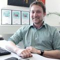

# Dominik Zajac runs BSD

My name is Dominik. In my main job I design, build, and maintain
IT infrastructure. 

In my free time I like to experiment with various UNIX and Unix-like
systems. I like [FreeBSD] to use ZFS as one of the best and most
stable filesystems I ever used. I am running several FreeBSD based
firewalls, a lot of FreeBSD VMs and around 10 FreeBSD ZFS file
servers, one [OpenBSD] laptop.

My first contact with FreeBSD was around 2002/2003 when I searched
an OS for an DEC Alpha I got for free. Since then I used FreeBSD
on different servers and machines. I use it since then beside to
Linux as my main OS for servers. On laptops OpenBSD just works
better and I have some Macs too. I tend to choose the tool to get
things done the best ways for me.

The port system on all BSDs I use is one of killer features.
The other good thing I love is that developers care how to upgrade
to the next version. This is even today not possible on all enterprise
Linux distributions.

I did a FreeBSD workshop some time in Landshut, Germany, and still need
to find the time do some follow up BSD workshops.

You can find me on [Mastodon](https://bsd.network/@banym),
[Twitter](https://twitter.com/banym), and I am [blogging from time
to time](https://www.banym.de).

_[31 Dec 2018](/raw/people/banym.md)_

[FreeBSD]: https://www.freebsd.org/
[OpenBSD]: https://www.openbsd.org/
