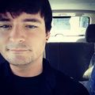

Hi everyone! I'm a geek from the US.

Initially, my introduction to this world was Red Hat Linux 7.0 around
the summer of 2000.  I loved it.  After distro-hopping through
Slackware, Debian, and Gentoo, I settled on an early release of Arch
Linux around 2003.

I continued to stay in the Linux world for many years, until a bit after
the systemd change-over.  Around 2013, I made the jump to OpenBSD after
having been fascinated by it for many years.

I quickly dove in and felt at home in the OpenBSD world.  Later, I would
opt to use FreeBSD on my laptop for more bleeding-edge software and
slightly better desktop performance, but OpenBSD still has a place in my
heart.

In November 2018, after hanging around this strange, but cozy, place
called the "Tildeverse," where retro computing and shell accounts are
all the rage, I realized there were no major BSD options.  That's when I
decided to open up [tilde.institute](https://tilde.institute) as the
home of OpenBSD in our corner of the internet.  It's even been featured
on the *BSD Now* podcast!  Episode 294 plugs the project.  If social
UNIX is your thing, come join us!  We hang out on IRC, slap together
various coding projects, and have a lot of fun doing it all.

Keep running BSD, everyone!

[Ben Morrison](https://gbmor.dev)

_[17 Jul 2020](/raw/people/benmorrison.md)_
