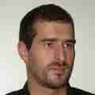

# Bruno Fl&uuml;ckiger runs OpenBSD

My name is Bruno Fl&uuml;ckiger. Since the beginning of my professional
career as a support guy at a small office I've used most of the
Microsoft products as well as different Linux distros.  I was never
really happy with neither of them, so I started looking for
alternatives. That brought me to [FreeBSD](https://www.freebsd.org/)
and later to [OpenBSD](https://www.openbsd.org).

OpenBSD is my favorite BSD. This system is consistent. Everything
is so easy to use. The documentation of the system deserves awards.
The project follows standards, not hypes. It gives you the freedom
to configure and use the system the way you want. There is no
bloatware in the system. There is no systemd. Quality is more
important than quick & dirty hacks to get some fancy feature in.

In my experience
[OpenBSD-current](https://www.openbsd.org/faq/faq5.html#Flavors)
is more stable than the releases of some other operating systems.

I use OpenBSD for everything I can. At home I run it for:

- Router, firewall, relayd
- DNS, DHCP, NTP, TFTP
- SMTP and IMAP
- Webserver for Roundcube and Nextcloud
- Desktop OS on my desktop and laptop

At work I use OpenBSD as mail security proxies. These systems fight
spam and malware, perform DNS checks and query the Active Directory
to validate the recipient address. My network manageing and monitoring
system also runs OpenBSD, as well as my personal laptop I use in
the data center to connect to the physical systems.

Find me on [Twitter](https://twitter.com/bflueckiger) and
[Mastodon](https://bsd.network/@buf).

_6 Aug 2018_
