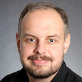

# Dettus runs BSD

What happens to a six-year old that starts playing with grandpa's C64?
He turns into a nerd and later becomes a geek, of course! And the best
part is, that he is still playing with computers as an adult, his
favorite toy from his childhood.

Hello, I am Thomas, but please call me Dettus. At the university, I met
a fellow student who once told me how much he loved [FreeBSD]. I decided
to give it a try, but ended up installing [OpenBSD] 2.7 by mistake.
However, since the kernel messages where blue, and blue is my favorite
color, it has INSTANTLY become my operating system of the heart.

Nowadays, I work professionally with Linux, but I like to slip in
OpenBSD whenever possible. Be that an extra virtual machine that nobody
asked for, a port of our software, or running the first check of a
powerful 72 core server, and finding out that OpenBSD could only see 64
of them... It does not matter!

It is always so much fun.

So when I found out about [openbsd.amsterdam](https://obsda.ms), it was
no question at all that it was the perfect fit for my little project
magneticscrolls.net. Head over now, have a look, and start playing
classic text adventures like "The Pawn" or "The Guild of Thieves" right
now, via SSH.

Enjoy!

Dettus

_11 Dec 2021_

[FreeBSD]: https://www.freebsd.org/
[OpenBSD]: https://www.openbsd.org/
