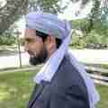

# Farhan Khan runs FreeBSD

My first experience with Unix was telneting into an OSF/1 Unix
system, which I later came to learn is a BSD-derived system. However,
I had almost no idea what I was doing. In about 1999, a friend
introduced me to Linux. I distro-hopped but eventually settled on
Slackware Linux 4, where I learned the foundational concepts of
Unix, the terminal and quite a bit of C programming. During this
time I was very interested in low-level programming and tried to
learn security from the largely blackhat community. Even then, I
always found constructing a solution or project more interesting
than breaking down a system or bypassing a security mechanism.
Despite my career choice in IT security, that is still my preference.

A year or two later the same friend introduced me to [FreeBSD] 4,
but given my use case as my personal computer, there was little
different between running Linux and somewhere down the line I
switched back.  I alternated between Linux and Windows all throughout
High School up to Graduate School, and eventually settled on Linux
Mint as my desktop of choice.

My return to FreeBSD was two-fold.

I started using FreeNAS to preserve my family's files. I was very
impressed by the system's functionality and tooling. Oddly enough,
rather than the system's intended purpose, I found myself using a
combination of jails, VIMAGE and IPv6 more than it as a fileserver,
to create disposable container environments for testing and
experimentation. I was very impressed with the ease of use,
organization and functionality. I consolidated all of my other
machines and devices onto a single machine, thus maximizing my
server density rather than running little raspberry PIs. I also
used one jail to host a fairly large security appliance I was writing
in Django on python3. And that leads into the second reason.

In writing said application, I reviewed on every element along the
stack to make it as efficient and functional as possible, including
the programming techniques and style, libraries, application server
and operating system. I always assumed Debian would be my go-to
operating system, but I figured I would give FreeBSD a fair shot,
especially considering my very positive experiences with FreeNAS.
Across every category I was concerned with, such as the ease of
use, tooling, file system options, base system disk footprint,
container technology and others, FreeBSD unquestionably won.

Since then, I have come to appreciate the system design, both under
the hood and from a user perspective. As a developer, having the
entire operating system in a single coherent source tree makes the
system a lot easier to understand and modify. I also find the code
a lot cleaner and easier to trace through versus GNU code. Growing
up, I always wanted to make contributions to various FOSS projects,
but tracing through the nests of preprocessor code or unnecessary
jumps proved too difficult and I lost focus. But BSD code is intuitive
and well-written. Also, the development tooling, namely dtrace,
make debugging and real-time analysis much easier. Linux has some
great efforts at tracing, but nothing as sophisticated as dtrace.

I work in Computer Security, specifically Penetration Testing. In
most situations and very unfortunately, Kali Linux is the default
operating system of choice. However, on the defensive side I have
noticed an uptick in pfSense deployments without people realizing
its FreeBSD on the backend.

In my opinion, FreeBSD is technically superior to Linux. The designs
are deliberate, stable and offers superior functionality. However,
it lacks in hardware and orchestration. Going forward, I hope to
help bridge this gap. In particular, I am personally interested in
contributing to the Wi-Fi drivers. I would also be interested in
helping to work on porting over Docker. I have a lot of other ideas,
but not enough time to implement them. On the side, when I come
across software that does not work on FreeBSD, I enjoy making minor
tweaks and submitting upstream patches.

I'm no one special, but find me on
[Twitter](https://twitter.com/FarhanYusufzai) and [Farhan
Codes](https://farhan.codes/).

_[12 Aug 2018](/raw/people/farhan.md)_

[FreeBSD]: https://www.freebsd.org/
