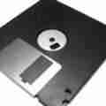

# fd0 runs BSD

How this came to be

It all started back in the early 90's when Dr.Dobbs Journal published
a series of articles with accompanying code for the [386BSD] Operating
System. For me this was "First Contact" with a Unix flavour. More
specifically, with a BSD flavour.

At that time I had no computer hardware and wasn't very interested
in various OSes so it took until 1996 until I got really involved
with Unix through my work, with various flavours of BSD, SystemV
and something in between.

These Unix variations I was working with at the time were:

- Ultrix
- SunOS 4.0.1, 4.1.1, 4.1.3
- AIX
- Irix
- SunOS 5 -> Solaris
- HP/UX

Back in 2000 I installed Rock Linux, a nice barebones distro onto
my laptop, a Sony Vaio 11". This was my first own Open Source OS
laptop.  This followed with a test machine at home, running Gentoo
Linux which again followed with a machine hosted in a datacenter
running the same early version of Gentoo Linux with Xen, LVM on top
of fully encrypted disks with LUKS, which ran fine for many years
until I was convinced by the late [Paul Schenkeveld] to migrate to
[FreeBSD] in 2007.

My first FreeBSD experience comes with [m0n0wall], as an early
adopter, installed on a Soekris embedded system, back in 2003. I
switched to [pfSense] a few years later on a newer version of the
Soekris hardware, which btw, is no longer available.

In 2007 I converted my rack mounted machine to FreeBSD 7.x with
jails and ZFS.

I am forever grateful to have been "customer #1 for this project"
of Paul Schenkeveld, who developed this with me using NanoBSD. I
served as his tester and bugfixer until all was working as designed.
This was later on upgraded to FreeBSD 8.1-STABLE.

This has been running for many years without a problem. I still
have this FreeBSD 8.1 running in the wild with this setup, which
will be decommissioned shortly. This decommisioning has been started
by purchasing a successor machine.

More FreeBSD came into play with the use of various [FreeNAS]
systems, currently on a FreeBSD 9.3. I know it needs upgrading as
well. Its successor may become a FreeBSD machine, not FreeNAS. I
haven't really figured that out yet.

Until April of this year I had no real experience with [OpenBSD] as
a platform. That changed when doing some consulting at a customer's
site.  They are an OpenBSD shop, infrastructure wise, using other
OSes for their main businesses.

The aforementioned new machine is running FreeBSD-11.2

Recently I came in contact with [Mischa Peters] thru a mutual friend,
for hosting this new machine and through him I also learned about
[OpenBSD Amsterdam]. I am a proud user of one of the OpenBSD Amsterdam
VMs.

OpenBSD is a very clean OS.

At the moment I am still finalising my FreeBSD box.  This is using
ZFS, obviously and jails (using iocage).  One of my main goals is
to get OpenBSD running as a bhyve guest.  Other BSD flavours, and
who knows some Linux as well, will also be tried as bhyve guests.

I am a huge fan of *BSD. You can find me on
[Twitter](https://twitter.com/fd0_nl).

_9 Aug 2018_

[386BSD]: https://www.386bsd.org/
[FreeBSD]: https://www.freebsd.org/
[FreeNAS]: https://www.freenas.org/
[Mischa Peters]: https://twitter.com/mischapeters
[OpenBSD Amsterdam]: https://openbsd.amsterdam
[OpenBSD]: https://www.openbsd.org/
[Paul Schenkeveld]: https://nluug.nl/events/vj12/abstracts/paul_schenkeveld.jpg
[m0n0wall]: https://m0n0.ch/wall/index.php
[pfSense]: https://www.pfsense.org/
