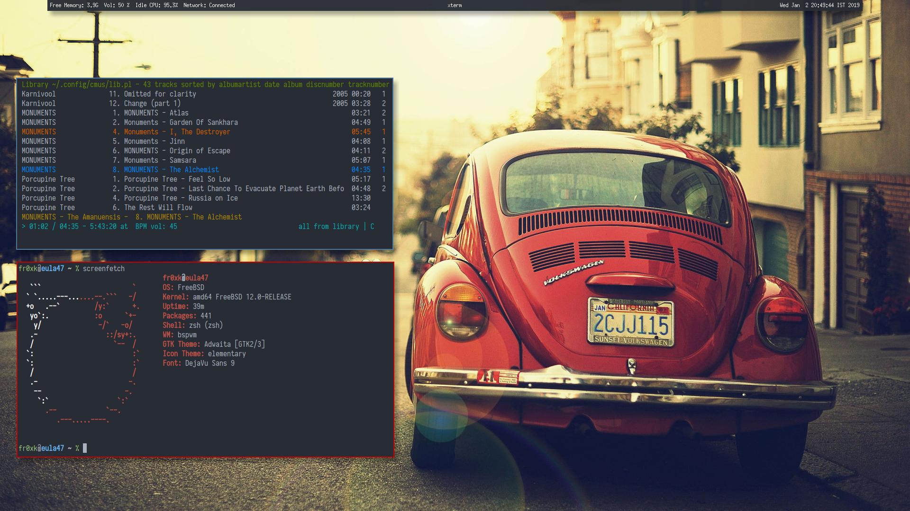

# Nikolai Lvovich runs BSD

Hi!

I am from Ukraine. I work as a soil researcher, and part time school
teacher in my hometown. Besides, I am a university student, pursuing
post graduation in Mathematics currently. I used to be a shitty
gamer, messed with digital audio, I still bang my head with Ibanez
RGD 2127z.

## Linux Period

I first encountered Linux with Ubuntu 10.04. I bought an HP laptop,
which had Ubuntu installed. I didn't even know what is an OS or
GUI, or package manager at that time. Windows was the OS by that
time for me.

I played with Ubuntu a few days, installing PPAs, random commands
copy pasted from the Internet until the system went to hell. Having
the only OS broken, I needed to do a fresh install of it. Honestly,
I never installed an OS before, so I decided to do this time, ended
up installing Ubuntu 12.04 LTS. It took me few a bit time to figure
out that I screwed my data of whole hard drive during installation
as I chose "Use the whole disk for Ubuntu".

That's the hell of my UX experience with Ubuntu. And since then,
understood what it likes to be a member of GNU/GPL church, anti
evil corporate, distro hopping from Linux Mint, elementary, Arch,
to Gentoo and so and so. But I honestly, never liked this kinda
socialism in technology myself.

When I realized, I have spent enough time on this, decided to stick
to something stable. I stayed in Debian since version 7 to Debian
9 release, but something always bugged me, Debian 9 was completely
strange for me. So I started to keep scratching my hipster head
within new cool kinds of stuff vs stability.

## BSD Period

I was learning to program as a hobby at first. Starting with bourne
shell, then influenced by the simplicity of C. These days, languages
are bloated all over the places, trying to solve various problems.
Be it Go, Rust, JavaScript and what not. While learning about
space-time complexity, I was introduced into LLVM. Chasing it, I
landed up in [OpenBSD]. I was running OpenBSD as a guest inside
Void Linux host. It's a simple operating system, as you all know.
To be honest, I initially screwed up by the BSD userland. Commands
were not the same, doing things were different, different init
system (not systemd, or SysVinit, etc, etc).

But...

The OpenBSD reddit community _r/openbsd_ helped me a lot. I able
to get familiar with OpenBSD tools and userland, learned basic
system administration for casual desktop use cases. OpenBSD Clang
was really helpful at teaching me common mistakes while I was
beginner.

By the time passes, I bought a MacBook, where I used dtrace a lot
for my programming practices which [FreeBSD] includes into. So this
time, I considered about installing FreeBSD on bare metal. Other
things I considered about FreeBSD system is..

- It actually looks and works like an OS. An operating system should
be a platform to run applications on top of it. I never liked all
packages being thrown into `/usr/bin`, from *dhcpcd*, to *LibreOffice*
in Linux userland.  This always bugged me. In fact, if a distro
comes with a full-blown DE, and users try to uninstall it/any part
of it, most of the time, it uninstalls critical parts like
*NetworkManager*, *Xorg* etc too (unless users pin that as manual
install).

- I always needed a dirty backup solution. I have been using
Clonezilla, fsarchiver in Linux, but It was very time-consuming.
ZFS can be used to work around here. I tried btrfs, and I failed
to understand the concept of subvolume. Snappy on btrfs works in a
way that makes me go nuts.

- Clang+LLVM, obviously, my go to. Autocomplete with company inside
Emacs works great. With Clang, I can mix the compiler front-end
with a targeted back-end and end up with highly portable and efficient
compiler.  Clang can perform static analysis of my code, and lets
me write tools that give information about a program. Static analysis
is a technique whereby the program is read and 'understood' to the
point where obvious bugs are automatically detected, such as dead
code, memory leaks, double-frees, bad pointer references, and other
such conditions.

- BSD license. It's so free you can make it not free.  I'm in no
way against the GPL, GPLv2/v3 both are good licenses, but I think
that's not practical. Besides, as Neil says, "What is more important
that more people run our *BSD code than we have control of what
other people can do with it". I prefer the license philosophy of
BSD license over GPL license. To me, free means do pretty much
whatever you want with the code. It's so free you can make it not
free like apple did.  Practically it probably has no impact on me,
but I prefer it on principle and was one of the reasons I chose to
use FreeBSD over Linux.

So, I decided to go with FreeBSD. I started with FreeBSD 11.0,
currently running FreeBSD 12.  I use a Window manager, called bspwm,
which is based upon binary tree design in mind. However, userland
changes over time.

_My desktop_

My experience with FreeBSD on the Desktop is polarizing... i.e.
when it works well, it's _fantastic_, way ahead of any Linux distro.
Great drivers' stability, no bullshit with audio, 3D graphics works
great, etc. Really good. But _only_ if it works... If hardware
doesn't fit inside a fairly narrow box (e.g. Nvidia Optimus), things
fail horribly. I still encourage people to try out FreeBSD or OpenBSD
with various boot environments.

So this is my story of Unix, Linux, and BSD. What's yours? I am
eager to hear.

_[03 Jan 2019](/raw/people/fr0xk.md)_

[OpenBSD]: https://www.openbsd.org/
[FreeBSD]: https://www.freebsd.org/
