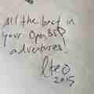

# Glenn Faustino runs OpenBSD

I'm Glenn Faustino
([@glenn_faustino](https://twitter.com/glenn_faustino)). I
administer Windows systems at work and run OpenBSD at home.

I started to use [OpenBSD][obsd] in 2007 when I
heard from Jesper Johansson (a Microsoft Security guy) that he uses
OpenBSD. This is where I started to get interested about it.

Why OpenBSD is my favorite? It's a secure minimalist OS, it has
sane defaults and its code is clean. I like the culture of the
projects. Everything you might need to provide a network service
is in base. The developers not only add new features, but also
_tedu_ (remove) garbage from the system. Aside from that they don't
let serious problems sit unsolved.

I always runs [-current][obsdf] to be able to test new features
which I'm interested in and to report bugs to help the project in
small ways. Also I managed to [donate][obsdd] a small amount to the
project.

I'm not using BSD at work now, but in the past, I ran my employer's
network on OpenBSD.

I use OpenBSD on my home wireless network as my router/firewall,
DNS, DHCP, proxy and bandwidth shaping tool on my apu2. I also use
it as my VPN server on the cloud to be able to connect my mobile
phone wherever I am. It's also my daily driver on my ThinkPads X200,
X220, and X62.

_7 Aug 2018_

[obsd]: https://www.openbsd.org
[obsdd]: https://www.openbsdfoundation.org/donations.html
[obsdf]: https://www.openbsd.org/faq/faq5.html#Flavors
