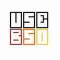

# Jay Patel runs BSD

It all started with PC-BSD. A friend of mine needed a server for
in-house project at his company, so  I set PC-BSD for him up and
warden with jail(8).

I've been in love with Unix since I started using BSD because of
its simplicity and documentation. My first jump to other BSDs was
after I read blog of [Adam Wo&#x142;k](mulander.html) about how he
is rolling with snapshots. Then I moved to [OpenBSD] -current, and
now I'm updating it using [Aaron](qbit.html)'s scripts.

Soon after that I started [my blog](https://bsdguru.in) powered by
OpenBSD 5.9. That's good for learning OpenBSD hands on. Currently
I run [BSD focused forum for newbies](https://unitedbsd.com). I
switch between major BSDs on my personal laptop, as I like using
them all from time to time. I'm helping to as many new users as I can
to migrate to BSD.

Find me on [Mastodon](https://bsd.network/@jaypatelani) and
[Telegram](https://t.me/unitedbsd).

_[3 Sep 2018](/raw/people/jaypatelani.md)_

[OpenBSD]: https://www.openbsd.org/
