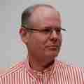

# Jan-Piet Mens runs BSD

I'm a freelancing consultant, and I give trainings. I started with
Unix systems in 1988, then on SVR4 and BSD, although I forget which
version.

I'll call myself a half part-time [OpenBSD] and a quarter part-time
[FreeBSD] user, though I wish I could "BSD" more than part time, but
most of my clients use Linux, and as such I'm obliged to as well.
I use both OSes as servers, even when I install them on laptop
hardware: I'm not interested in messing about with display, audio,
or WiFi settings, and I don't think I've ever attempted hibernation.
It may shock some, but to me there's currently no better laptop
experience than what I get with macOS. So there.

The support for OpenBSD is amazing, as [this short tale of a PoS
display][pos] shows.

OpenBSD's and FreeBSD's documentation (online and offline) are
excellent. Typing `man something` and getting accurate documentation
is priceless, and both systems excel at that. If I had to single
out one strength of OpenBSD and/or FreeBSD it would be their
documentation.

You can find me on [Twitter](https://twitter.com/jpmens) or
on [Mastodon](https://mastodon.social/@jpmens).

_7 Aug 2018_

[pos]: https://jpmens.net/2018/06/19/on-a-pos-pole-display-and-an-open-source-os/
[OpenBSD]: https://www.openbsd.org
[FreeBSD]: https://www.freebsd.org
