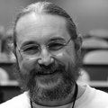

# Ollivier Robert runs FreeBSD

I read the Jolitzes's series of articles in Doctor Dobb's Journal
back in 1991 and started with 386BSD when it came out.  Then [FreeBSD]
1.x in 1993 and ever since.  I became a committer in February of
1995 as [FAQ] maintainer.

How do I use BSD these days? Every server-related stuff (mail, www,
uucp, ssh, ports building) is done on FreeBSD boxes. Every service
is in a jail, of course.

When I was a sysadmin, I ran our entire authoritative DNS servers
on FreeBSD 3.5, but I was then told that the upcoming outsourcing
company did only Solaris (and Linux afterward).  

BSD did give me lots of contacts and friends all over the world.
Every year, be it in BSDCan or EuroBSDCon, new people keep coming
in and that's great.

You can find me on [Twitter], [Mastodon], and [my website].

[Twitter]: https://twitter.com/Keltounet
[FAQ]: https://www.freebsd.org/faq
[Mastodon]: https://mastodon.social/@keltounet
[my website]: https://www.keltia.net/
[FreeBSD]: https://www.freebsd.org/

_[12 Sep 2018](/raw/people/keltounet.md)_

[OpenBSD]: https://www.openbsd.org/
