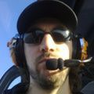

# Pierre Pronchery runs BSD

I'm a freelance IT-Security Consultant. This position I am in just
sort of happened, a lot like my relation to the BSD community. I
will try to remain brief while not skipping the important parts.

I had access to the first computer at home when I was around seven:
a 286 with 640K of RAM, running MS-DOS and Windows. By then it was
mostly about video games for me, but I was also into figuring out
how the system worked, from hexadecimal editors to productivity
suites.

I did not have regular Internet access until around 1998 though,
when I was also introduced to Linux by a friend in high school. I
got hooked by Open Source, gave [FreeBSD] and [OpenBSD] a try but
held onto Debian. Never fully satisfied by major distributions, I
first tried to fork Debian in 2001, with a graphical install CD,
before basing this new distribution on [Linux From
Scratch](http://www.linuxfromscratch.org/).

I gradually gave up gaming in favour of programming at the same
time. I figured that I would learn more by reimplementing the wheel
than by packaging software, and started an Operating System project
called [DeforaOS](https://www.defora.org). A lot of this work got
me interested in security and into this community, eventually landing
a job there.

This is also when I was introduced to [NetBSD](https://www.netbsd.org)
during a Systems Administration class in 2004. We were in groups
of four, with three computers per group. The assignment was to
network a Windows client with a server and another client,
enterprise-grade with shared authentication and roaming profiles.
Our group was strong and the teacher wanted to make our life harder
by forcing us to use NetBSD as the second client.

I got instantly hooked by NetBSD instead. I re-oriented my Operating
System project around NetBSD's kernel, and migrated all my systems
to this platform. This included unusual hardware like an Ultra 60
that I used as my main desktop until 2009, or tablets like the
Zaurus or Nokia N900 for instance. I keep working on my dream
smartphone since then, which would of course run NetBSD.

Finally, I became a member of the NetBSD Foundation in 2012. I am
even serving on the Board of Directors since 2017. So what was meant
to be a handicap on a school assignment got me pretty far into the
project!

You can find me on [Twitter](https://twitter.com/khorben),
[Mastodon](https://mastodon.sdf.org/@khorben), and
[GitHub](https://twitter.com/khorben).

_[12 Jan 2019](/raw/people/khorben.md)_

[FreeBSD]: https://www.freebsd.org/
[OpenBSD]: https://www.openbsd.org/
