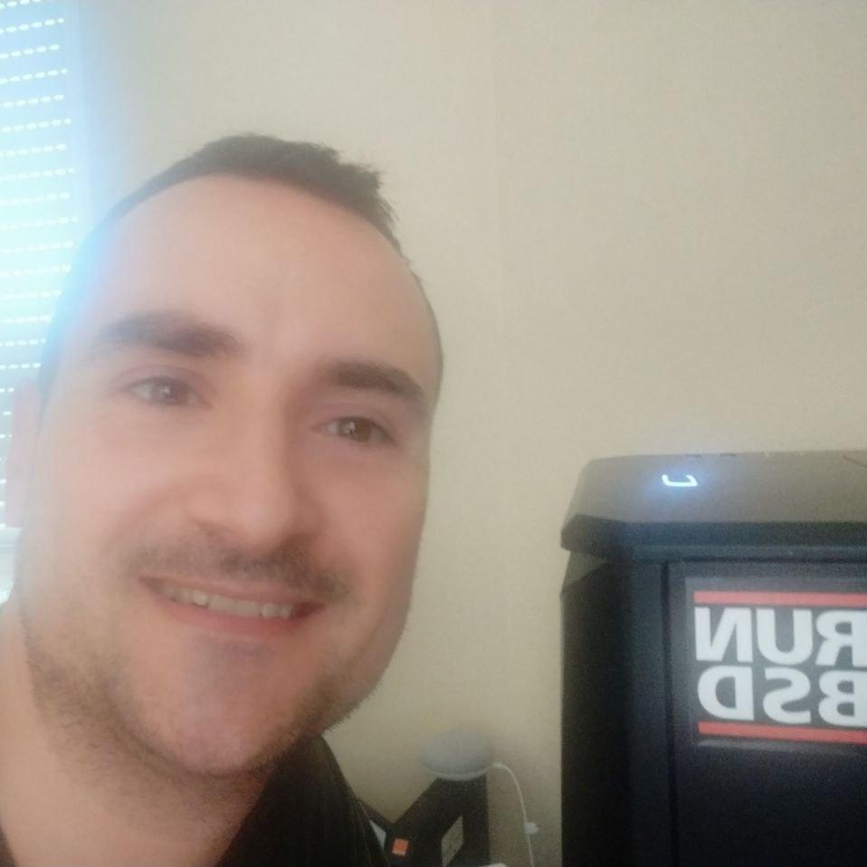

# Kr0m runs BSD

My name is Juan José Ivars Poquet (aka kr0m), my first computer contact
was in 1998, my cousin got a Compaq pentium I where he had Windows 95
installed, my first thought was that it was so strange to have to wait
long load times to start a demo of MDK game. My second touch was a 486
where a friend and me were playing some sort of spaceship simulator, the
computers didnt impressed me yet.

Finally at age of 15 we had the family PC, it was a pentium I with
windows 98 loaded, I spent a lot of hours poking around regedit and
breaking things. One day I went to my favourite bookshop and saw a
little book, it was named: "cracking", I didn't know what it was about
but I bought it anyway, it was the begining of another era, that book
explained me that software can be modified and it can behave like we
want even without the source code, in the end all binaries are ASM
instrucctions that can be patched. Then I bought the other books of
@rroba, "Hackers", "Linux" and "Virus" it were exciting times.

At age of 16 I finally had my own computer, I could install the OS that
I deserve and make all kind of tests, it was a pentium IV an expensive
machine in that times. The first night I burned my monitor installing
RedHat with the wrong refresh rate, fortunately I could exchange without
costs covered by the warranty, I finally installed Mandrake because it
autoconfigured my monitor for me. One year later I got Internet throught
a 56K modem, pitifully it was a softmodem so I only used it with my
Win2k, I installed an RPM driver but it was capped to a fraction of the
modem speed. In the institute we started to code in VisualBasic using
Microsoft Office macros, I signed up for a Visual Basic course in an
academy near my house, it was amazing, I could control my pc and do what
I want the way I want.

My next step was to get into computer science degree, there I knewn some
friends that talked to me about Polinux, a comunnity of Linux
enthusiats, I heared about Gentoo and Debian, in my third year I finally
got Internet access and it was revolutionary a flood of information
available to me. I decided to install Gentoo, stage1 of course and I
enjoyed a lot of, I learned in that years more than in the last 5 years,
Gentoo+Internet the perfect combination. I learned a lot of Linux
internals, kernel compilation, boot process, user and groups
administration, permissions and all kind of other things. One of my
friends talked me about FreeBSD but I was too much busy with my Gentoo
system to start learning another OS. For exploring something diferent I
took advantage of my student position asking to Sun for a Solaris copy,
all for free, I tested in a VirtualBox VM but I didnt continue
investigating it.

When I finished my studies I worked with Cisco Systems and I decided to
get CCNA/CCNA-SEC I learned a lot of about networking, I was interested
in security too so I started using Backtrack and finally I installed
[OpenBSD] in my laptop but the wifi didnt worked so I reverted to Debian.
Then I changed to a PBX administrator job, we used Debian as base system
and Asterisk as soft-PBX, I learned the basics of SIP protocol that was
useful for my next job where I changed job to a Telco company that was
using Gentoo and Kamailio. My last years I have been working with
Gentoo/Ubuntu systems, deep learning of Gentoo portage system introduced
me to [FreeBSD], and one work friend encouraged me to start testing it, I
started reading the excellent handbook and I was hooked.

I installed it on my home pc and home server and I used it every day, I
was impressed with the ease of use, organization, functionality, man
pages documentation, rock solid stability and the simplicity of RC
system. I liked very much the idea that FreeBSD is the complete
operating system, everything comes from one source, in that way all the
system remains consistent between updates. Separating User programs from
base operating system files is magnificent idea to keep base system
clear over the time. Later I discovered the FreeBSD community, I
immediately realized that its heavy technically prepared, when anybody
answer your questions they know what they are talking about.

Since I started using FreeBSD I am so happy and I have never looked
back.

What I appreciate the most of FreeBSD system is RTFM/KISS/UNIX
philosophy, ZFS, Jails, BootEnvironments, the whole system is carefully
planned and consistent, the project follows standards, not hypes and
quality is considered more important than quick and dirty hacks to get
some fancy feature in.

BTW if you want to contact me you can find me at:
[alfaexploit.com](https://alfaexploit.com)

_[7 Aug 2021](/raw/people/kr0m.md)_

[FreeBSD]: https://www.freebsd.org/
[OpenBSD]: https://www.openbsd.org/
