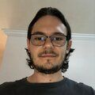

# Marcelo Barboza runs BSD

I'm Marcelo, a brazilian mathematician that recently
discovered the joy of (Open)BSD.

As kids my brothers and I didn't have computers at home since our
parents couldn't afford them.  It never meant any more than that
for the three of us as there were plenty of other things to do.

At college I had my first personal encounter with a computer. It
was in an introduction to programming with an eye toward the Pascal
language. Back then, the faculty lab ran Fedora Linux (version 4
or something, I think) and it didn't bother me (since I didn't know
any computers at all, any OS would be just the same for me at that
particular period of time). Moving two years forward in time, my
mom gave me, as a gift for my bachelor's degree in Mathematics, my
first personal computer --- which was an Acer laptop.

That laptop came with Windows Vista in it and because of that I
kept reinstalling the system every two months.  It occured to me
that by installing Linux things could get a lot easier for me (and
I already knew Fedora, so...) Ever since August of 2008 I've been
running open source software --- exclusively.

After years running either Debian or Slackware I developed an
increasing curiousity about other OSes and even came to install
FreeBSD one or two times but couldn't quite handle it due to my own
ignorance about the system and sometimes the lack of time to learn
it properly.

After some searches for one line solutions to some of the questions
I was facing I started following [Tim Chase](https://twitter.com/gumnos)
on Twitter (and we all know how skillful he is in this field). It
was just a matter of time until I heard from [Roman
Zolotarev](https://twitter.com/romanzolotarev) and, to be fair,
from many others in the BSD community. What I mean here is: the BSD
community is a lot more vibrant than I could have perceived in the
past.

Finally, I got to [Roman's personal web page](https://rgz.ee). There
I read many of the very didactical tutorials posted there. It gave
the push out I needed to make the move to [OpenBSD]. I now run it
on my personal laptop and also at work, on my desktop. In fact, I'm
encouraging my students to make the same --- hey, OpenBSD is
proactively secure.

Find me on [Twitter](https://twitter.com/SalveBarboza).

_[16 May 2019](/raw/people/marcelo.md)_

[OpenBSD]: https://www.openbsd.org/
