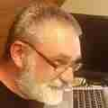

# Peter Hansteen runs BSD

My name is Peter Hansteen. I am a sysadmin who builds and runs
infrastructure with Unix boxes and other network thingies.

My preferred operating system is [OpenBSD], without which neither
[The Book of PF] or the freely available blacklists (see [the
traplist home page] or various blog posts such as [this one]) would
be possible. I try to insert OpenBSD boxes in the environments where
I work whenever appropriate, but I have been known to tolerate and
operate systems such as FreeBSD, Solaris, Linux or even brand name
systems that pretend not to be built on a BSD or Linux foundation.
Other than a few very specific use cases, I still prefer OpenBSD
over them all.

But anyway, part of purpose here is to tell the personal story.
I'll go all the way back to the very beginning.

My first contact with BSD systems did not seem at all consequential
at the time.

This was the second half of the nineteen-eighties, and I was working
as an office clerk (a typist, and although the IBM Selectric typeball
machines age was deemed over, we still had some within reach) at
the Norwegian School of Economics and Business administration.

My original career plan did not include computers at all (at the
time I still&mdash;for no good reason&mdash;fancied myself a musician
of sorts) but I started hanging out with colleagues who worked for
the institution's computer department, and this being the late
eighties, the school had very recently gotten attached to the
European research network, which in turn was in a sort of 'inter-network'
arrangement with the US ARPANET.

The school itself was mostly DEC (TOPS-20 and VMS) oriented, but
we were allowed to log on to systems elsewhere, and more often than
not those would run something called "BSD Unix". I never got around
to doing any real work on those system, only some exploring and a
bit of harmless playing around. The details have largely faded from
my memory now.

Fast forward a few years that included me morphing from typist to
IT support staff while taking night school programming classes,
jumping to the private sector to do mainly software localization
and documentation but always a bit of other tinkering, even starting
a consulting business, and in the early nineties my company and a
partner firm found we needed Internet access along with proper
email, with such things as domain names matching the company names
and so forth.

I'd read the Dr. Dobb's series about porting BSD to i386 when the
articles came out, so I was aware that BSD Unix was becoming available
on hardware I actually had within reach. I found a source for FreeBSD
CD sets but also bought an early Red Hat Linux as something to
explore. As it turned out, FreeBSD was not actually usable on the
hardware I had (again I forget the details, but I think it had
something to do with non-SCSI CD drives attached to sound cards),
so I ended up setting up our first Internet gateway and mail server
on a Linux system. Sendmail and words about the same were had, as
was to be expected at the time.

If you've bothered to read this far, you know it didn't stay that
way forever. I kept hearing good things about FreeBSD and found
spaces where it fit in the things I did. Once OpenBSD materialized
some twenty-odd years ago I decided that the emphasis security and
correctness in code made it worth checking out.

Installing OpenBSD for the first time after dabbling mainly in Linux
and FreeBSD was quite a revelation. The minimum hardware requirements
were even more modest than the Linux distributions I was used to
slinging around, and poking around the system I found that anywhere
I looked, what I saw just made sense. A lot more sense than the
others. Everything seemed well thought out and *everything* had a
man page that actually made sense and was up to date with its
subject.

Over the years that followed I started inserting OpenBSD boxes in
the places they fit in with systems in my care. At first mainly
with PF firewalls, incrementally expanding with other functionality
as I learned how.

Some of these things have, time and client confidentiality allowing,
surfaced as blog posts or even parts of [The Book of PF]. You can
find more at my infrequently updated blog at [bsdly.blogspot.com]
where I tend to write about the more unusual and hopefully interesting
experiences. When conferences will have me, I have been known to
do tutorials and talks on topics more or less in the same vein.

The email address I use on OpenBSD mailing list is likely the most
convenient way to reach me. I'm also on [Twitter] and [Mastodon]
as well as the Facebook and Google+ OpenBSD groups.

_[14 Aug 2018](/raw/people/pitrh.md)_

[Mastodon]: https://mastodon.social/@pitrh 
[OpenBSD]: https://www.openbsd.org
[The Book of PF]: https://nostarch.com/pf3
[Twitter]: https://twitter.com/pitrh
[bsdly.blogspot.com]: https://bsdly.blogspot.com
[the traplist home page]: https://www.bsdly.net/~peter/traplist.shtml
[this one]: https://bsdly.blogspot.com/2017/04/forcing-password-gropers-through.html
