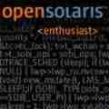

# Sehnsucht runs BSD

I'm 24-years-old Italian Medicine student and apprentice (6th year
at Sapienza University of Rome), free-time Unix and retro-computing/gaming
passionate. My other interests include philosophy, rock and classical
music, inline-hockey/skating, skiing, mountain biking, black & white
movies and seinen manga.

I've been a computer geek practically since I have memory. Living
in the country-side and lacking easy means of transport I was often
held back from playing with other kids and this resulted in me
spending a significant portion of my time playing 15/18+ games
(Doom, UT, Shadow Warrior, Daggerfall, Max Payne) and hacking around
on computers.  I recently came to the conclusion that most people
of my age first came in contact with computer software either through
Windows XP or OS X Leopard; this results in them not being comfortable
with command line and expecting the computer to automatically do
things for them. That's neither bad or unfortunate, it's just a
matter of fact.  Yet, my story went a little bit different, and I
think it gave me the chance to learn a lot while having tons of
fun.

My family got its first PC in '98, second-handed and practically
for free, thanks to my uncle performing a hardware upgrade towards
P6 Pentium and letting us take his 1993 IBM PS/1 (486SX, 6MB RAM,
512MB IDE HDD, currently sold for parts), which used to come with
PC-DOS 6.0 and Windows 3.1. My uncle taught me the basic commands
to type in order to launch games. As a 5 years old and curious kid,
whose favourite toy up to that moment had been a fake laptop, I
immediately fell in love with it. With the passing of time I started
wanting to know more about DOS, try new commands and quickly became
the first tech-aware person in my family (my parents both still
have great limitations in using Windows or Android nowadays), albeit
I managed to mess the system up several times, in spite of all the
core files having `ATTRIB` set to `+RSH`.  By the turning of
Millennium, with the spread of PCs, Internet, Windows and MS Office
in offices and schools, we needed a machine capable of running
modern 32-bit Office and IE versions. In Jan '01,  my mother told
a programmer friend of her to build us a brand new machine, which
turned out being a fabulous PC, equipped with a Netburst Pentium
IV, 256 MB RAM, running Windows ME on a FAT32-formatted 60G storage
(currently running Illumos, Tribblix  0m20.4 x86 on UFS), with a
remote-band dial-up 27 kbit/s connection, which can be easily
accounted as my favourite PC of all times.

Every Sunday morning at the newsstand, I used to buy a magazine
named "Games for My Computer" which usually came bounded with great
game titles, mods, patches, reviews, demos, shareware, up to date
DirectX, at the modicum cost of 3-5 euros. As the years passed by,
I started buying other software-related magazines, until my attention
was caught by an article speaking of the proprietary UNIX system
history and its derivatives. It intrigued me so much, that I spent
the following days doing researches on this fantastic OS, and the
other CPU archs than x86/IA-64 it ran on, all of which I had been
completely unaware of until that moment.

I wanted to learn use it, and Solaris was the one which looked most
promising and interesting to me at first sight, although running
it was _obviously_ completely out of question, being it a
server/workstation oriented OS meant for professional usage, running
on way too expensive hardware, in a time when all I needed was a
simple notebook for high school supporting an office suite and few
more programs. I had already made up my mind to either buy a MacBook
or get a Mandriva CD and Linux-supported laptop, when I discovered
about the pending release of OpenSolaris: open source Solaris with
focus on desktop including the latest GNOME, Firefox, Adobe Flash
Player and OpenOffice versions: "that's it", I thought, and few
months later I had my parents order a Toshiba Tecra M10 based on
Centrino 2 platform (Intel Core 2 Duo 2.4 GHz, 4GB RAM DDR2, Intel
Wireless, currently running OpenIndiana 2018.04) coming with
OpenSolaris 2008.05 pre-installed. Everything worked out of the
box, exactly as I expected, even better and I began appreciating
the value of FOSS.

I spent a lot of time playing with it, especially on customizing
GNOME2 (it was so good! still using MATE now) and attending DeviantArt,
in accordance with my previous experience with Windows XP customization.
I remember the eye-candy OpenSolaris screenshot on DeviantArt by
Vermaden. I learned about general Unix command line, started shell
scripting, and decided to pick up some Java programming basics
(OpenSolaris included NetBeans) as a self-taught.

After the Sun acquisition by Oracle and the following OpenSolaris
withdrawal, I kept using it as long as it was worthwhile (c. 2011).
Later on, after having briefly considered the possibility of
OpenIndiana, I decided I wanted to try something new, with a wider
software availability. Providing I wanted to see how Windows was
faring too, I ended up switching back to Windows and installed 7.
During the last 3 high school years in fact, my interest towards
software as leisure-activity was progressively eclipsed by other
things, mainly friends, girls, books, the hockey championship.
Choosing what to do of my life turned out quite the hard task: I
loved many things, especially physics, biology, Latin and Greek,
computer science and philosophy. But I knew myself all too well, I
knew where my path was headed, I wanted to help people, and realized
my choice had been taken already.

At University, I slowly began missing all that geeky stuff and
started thinking about installing a Unix OS and dedicate part of
my spare time to it once again. I remembered reading about the BSD
OS family and downloaded [FreeBSD] 9.3 in late 2013, putting it on
the Toshiba first (on UFS2), and later on on a 2011 Samsung NP-R519
(even this one, fully supported) laptop, which my father gave me
after having totally messed it up and giving up with it, even though
he told me he had been forced to buy more powerful hardware for his
job (the program he needed didn't require more than 300 MB RAM).
I loved FreeBSD and its Handbook from the very first time. Well-designed
OS, stable, and consistent, very featured userland especially in
regard of networking tools, amazingly performing. The community
(and the BSD community in general) is very friendly, competent,
professional, but also prone to joke and have some fun from time
to time. FreeBSD increased my interest towards netsec, firewalls
and servers, until I ended up building a cheap FreeBSD box serving
as a FTPS NAS first, and jailed NextCloud on AMP stack next, behind
a IPFW firewall. This was mainly for learning/fun purposes. In the
meantime, I've also experienced  setting up a media server (Plex,
Icecast + MPD-httpd, and LAN UPnP with minidlad + Kodi client).
Thanks to this, I learned a lot about networking and security, and
FreeBSD tools and documentation surely made that job smoother.
Lately I've also found the time to try bhyve and I must admit
developers did an amazing job improving it in the last few years.
It's become a serious, neat and performing hypervisor to the point
I think it's significantly underrated (Joyent wouldn't have ported
it to Illumos otherwise, already having KVM!). Around a year ago
my savings reached a dignitous-enough amount to allow me to buy and
build a custom desktop PC (not calling it workstation, cause that's
not the case). It currently runs FreeBSD 11.2 on ZFS with a FVWM
desktop, residing inside the rented flat I share with a colleague
in Rome, I also use it as a MPD music station with a SNDIO backend
(+a couple of good speakers), as  host for bhyve and VBox VMs (the
OpenSuSE VM is dedicated to Netflix and Spotify), native FOSS and
Wine gaming: I discovered that many games I used to play in the
early '00s actually work very well under wine, so I'm having great
fun on it; also, here I want to thank the #openbsd-gaming community,
and Pertho in particular, for hosting the Quake Tournaments.

Meanwhile, I got bored again and decided to try other OSs. I tried
Linux, Illumos, the other BSDs, and FreeDOS.

Be it PC-DOS nostalgia, but I became immediately committed to the
FreeDOS community and development, participated to mailing lists,
deployed FreeDOS retro-gaming stations for friends, while starting
over playing a lot of 16-bit games, wrote tutorials, went back using
Corel Word Perfect 6.22 as my writing suite, started learning C on
it, analyzing FreeDOS internals through Pat Villani's FreeDOS kernel
book, reported bugs on new OpenGEM desktop release, and even committed
some patches. Currently I run FreeDOS on my mother's old Acer
TravelMate (from 2000).

Trying Illumos instead brought my old Solaris love back to life and
even enhanced it. SMF, RBAC, CrossBow, Zones, SunStudio and the
fantastic Solaris userland are still there kicking. OpenIndiana is
the spiritual continuation of OpenSolaris anthe most true to it. I
run OI-Hipster on my Samsung laptop with a fluxbox desktop.  In the
future I'd like to actively contribute to the IPS OpenCSW community
repo. Tribblix is a very well-thought piece of software.  The fact
it's only maintained by a single person (who's actually also quite
keen to help users) really puzzles me: clean, lightweight Illumos
distribution, still supporting SPARC and x86, with a fantastic
packaging system (zap overlays) and up to date software, what else
could I ask? It brought my old Pentium IV PC back to life, showing
off some true old school taste with the latest CDE 2.3.0 release.
My plans for (a rather distant, due to lack of time and money)
future include buying a Sun Blade 1000 and building a v9OS (Illumos
distro) SPARC box.

The BSDs are all terribly alluring. It's incredible how different
they can be from one another (well, that's what happens after 25
years of divergent development with different goals in mind), and
how each one is perfect in its own way and still carries great
advantages over the others. From my perspective, there's no clear
winner among BSDs: they all do exactly what they're thought for in
a (almost) shameless way.

Personally speaking, given my tastes, and priorities, I came to the
conclusion that the only BSD I like (slightly) more than FreeBSD,
is [NetBSD].  NetBSD is fun to use. I find it difficult to explain,
but it's a really enjoyable OS. It has those uncommon yet effective
design choices which make you stop and say: "hey, that's brilliant!".
NetBSD stands firm on its roots and is still very Unixist, actually
in my opinion the most consistent with 386BSD.  NetBSD is extremely
simple, neat, lightweight, versatile, and portable. Performs
wonderfully on limited specs, old hardware, older archs and especially
embedded hardware. ARM SoCs support is astonishing, and it's improving
fast, especially on aarch64. Xen dom0, pkgsrc, NPF, Rump Kernels,
KASLR, nouveau, LVM, the almost ready ZFS, are other great features.

Currently I run NetBSD on the old Toshiba, on my Rpi3 and on Pinebook
(both through aarch64 port).  The Rpi3 works as NPF firewall, while
I use the Pinebook as IceWM desktop.  I've successfully carried out
some nerd experiments on NetBSD, like running 4 Xen domU VMs at the
same time, building and running NeverWinter Nights Linux client
under the SuSE compat layer, setting up my mother's private office
router as a NetBSD box, building a NetBSD/HEAD Cinnamon desktop
using pkgswc-wip,  deploying my personal Mail Server (OpenSMTPd,
Dovecot, Rspamd, dkimproxy, SquirreMail, NPF, Squid, Clamav):
eventually dismantled it due to time and money required to maintain
it and compared to advantages. Fastmail user now!  I've seen many
people using NetBSD as learning platform: indeed I continue learning
C on it.

In the last year I've been into *BSD and Illumos advocacy a lot on
social media. Those OSs are often undeservedly ignored and should
get more attention as examples of Unix done the right way. Wish I
could also help user Trihexagonal with his [tutorials on FreeBSD
desktop](http://trihexagonal.org). For the moment, I'm just
contributing with screenshots.  I think so far I managed to bring
to BSD no more than a couple of pen friends known on *nix fora, one
to OpenBSD and OI-Hipster, the other to NetBSD.  An Italian friend
of mine (IT graduate) decided to put FreeBSD on Chromebook, after
hearing me talking about it. My interest towards FreeBSD, led me
to make new precious acquaintances, especially Scott Robbins
(scottro), veteran admin and fantastic person, with whom I keep
corresponding by mail.

In contrast with some Linux users spawning Arch Linux installs on
their relatives/friends/partners laptops, I'm of the opinion people
mustn't be forced, neither allured or convinced with false promises.
People need to be shown, providing they have the time and the will
to hear, make up their minds by their own-selves, and only then see
whether the red pill is suited for them or not. This more or less
applies to every single field of knowledge, not solely operating
systems: for instance, it applies to Medicine too.

Find me on FreeBSD Forums and DaemonForums (@Sehnsucht94), as well
as [Mastodon](https://bsd.network/@sehnsucht) and
[Twitter](https://twitter.com/Vins_Quotes).

_[21 Aug 2018](/raw/people/sehnsucht.md)_

[FreeBSD]: https://www.freebsd.org/
[NetBSD]: https://www.netbsd.org/
