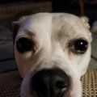

# Kirpaul runs BSD

Hello fellow BSD users. My name is Kirpaul and I have been using
computers since my first 486 DX2-66 in 1993. Hated them prior to
that for whatever reason, but once I unboxed that Packard Bell and
fired it up, I knew I was hooked. I immediately got rid of Packard
Bell Navigator and uncovered the even more horrific Windows 3.11
for Workgroups. I didn't know what was out there but I knew I didn't
want Windows. I immediately started searching for a replacement and
found OS/2 Warp, which I quickly got and installed via floppy. When
Windows 95 came out I jumped back on that bandwagon because it
frankly didn't look bad and I thought it would be fine. After many
blue screens and frustrations, in 1998 I found Mandrake Linux in
my local military exchange for around $30. I installed Linux and
never looked back. I had zero knowledge of BSD at that time.

Later during my Linux desktop usage I did hear about [FreeBSD], but
still didn't know anything about it or how it was different than
Linux. After 20 years of Linux usage, I grew tired of discord in
the "camp" and the implementation of systemd, which although worked
for me, did not sit well with me in terms of overall design philosophy.
It did not do "one thing and one thing well", it did 500 things and
was not simple at all. I had a friend at work that was a huge FreeBSD
fan, albeit for servers, not desktops. Through his encouragement,
I went for it and replace Linux as my desktop with FreeBSD. I am
not going to say there weren't growing pains, but I persevered and
am 100% on FreeBSD 12.0-RELEASE as my desktop. I can write, do
banking, scan docs and photos, game, anything I could do on my Linux
desktop previously.

I now have a monster workstation (HP Z800, 2x6 Core Xeons, 96 GB
RAM) I use headless as my package build server and serve packages
to my brand new home built PC running 12.0-RELEASE. I implemented
poudriere on the build box and use nginx to serve the packages to
the PC. This was implemented using how-tos graciously contributed
by the FreeBSD community on [the FreeBSD
forums](https://forums.freebsd.org/). The sense of community and
amount of help makes me feel excited to fire up my system, learn
new things and contribute back to help others. You will not find
this sense of community among commercial OS users.

Thanks go out to [Roman](https://twitter.com/romanzolotarev) for
providing the means to share our stories!

You can find me on [Twitter](https://twitter.com/Sevendogs5).

_[28 Jan 2019](/raw/people/sevendogs.md)_

[FreeBSD]: https://www.freebsd.org/
