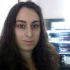

# Solene runs BSD

Hi, I'm Solene, sysadmin hacking on [OpenBSD] for fun as a hobby.

I discovered Linux thanks to a school friend who bought a magazine
with Slackware CDs set and installation instructions.  We tried it
together on an old computer at home and I just liked having something
different on the computer, even if I had no idea about what to do
with it.

My curiosity has grown and once we got an unlimited internet access
at home, I discovered there were others linux systems, and some had
nice GUI for newbies like me, I'm thinking about Mandrake linux and
its graphical installer and administration GUI.

I think I was 12 years old at this time.  I had no family member
or friends in IT and I was in a small city, so I had no one to meet
to extend my knowledge.  I'm a slow learner and I need to practice
and do by myself to understand, it's not efficient and fast but I'm
pretty happy when I see how far I went since!

Over the years, I consolidated my knowledge, discovering new linux
distributions, discovering what a protocol or a daemon are. Fun
fact, I think I felt into IT due to the movie "The Big Lebowski",
I liked that video so much I wanted to host my very own forum about
the movie, using a phpbb forum and hosting it at home. This made
me learn about apache, php and mysql, public IP, TCP ports and NAT,
then I realized it was only plumber work.

I went to university into a programming training as there was no
sysadmin degree. At this time, I was a regular OpenSolaris and
FreeBSD user. I really enjoyed using OpenSolaris, it was my main
OS for years. But once it was killed by Oracle, I did slide slowly
to FreeBSD. As I was curious, I was often trying others BSD and my
laptops were shifting systems every week!

After university I succeeded at the BSD Certificate Associate exam.
I remember having to drive 800km from home to attend the exam! I
got my first job in 2011 in a small IT company, where I still work.
I migrated servers from Linux to FreeBSD then I acquired a lot of
experience about "real world" issues and solutions thanks to my
colleague. Over the years, I've been more and more disappointed by
FreeBSD choices and quality, my laptop moved to OpenBSD around
release 5.9 and I've been using it daily since that time.

OpenBSD was working on my laptop, everything worked out of the box
and there was no required tweaks like on FreeBSD. As I was using
OpenBSD daily, I came to report issues I found on -current and I
was trying ports diff on my computer.

I only enjoy writing code from time to time and I mostly write
common lisp code or awk scripts. I wasn't really able to contribute
to base code with those skills, but I was able to apply diffs,
compile and report if it was working or not. After some time, I've
been invited to a hackathon by jca@ and then I was invited as a
developer which made me really happy and thankful.

As an OpenBSD developer, I have been mostly working on ports at
first, then I have learned about how man page are written. This
made me contribute to OpenBSD documentation and I really enjoy it.
I've been quite active on OpenBSD IRC channel, I've seen people
being clueless due to missing explanations here and there, so I've
did my best to enhance documentation to make it easier to understand
to everyone. Lately, I've resurrected stable binary packages (which
disappeared around OpenBSD 4.x I think) and I am very happy about
this.

I can't say I'm a very active developer but I always contribute to
make OpenBSD better for everyone and that make me happy. If I have
no fun working on something, I just don't work on that thing. Hacking
on OpenBSD is often fun especially when it make other people happy.

Now I use OpenBSD as much as I can, my various computers are home
use it and my servers too. For me, it's the only operating system
that really care about quality and sanity over the so called "user
experience", I'm especially thinking about recents defaults like
disabling microphone, disabling hyperthreading or webcam device
restricted to root.

[@solene](https://bsd.network/@solene) 
[dataswamp.org/~solene](https://dataswamp.org/~solene/)

_[21 Nov 2019](/raw/people/solene.md)_

[OpenBSD]: https://www.openbsd.org/
