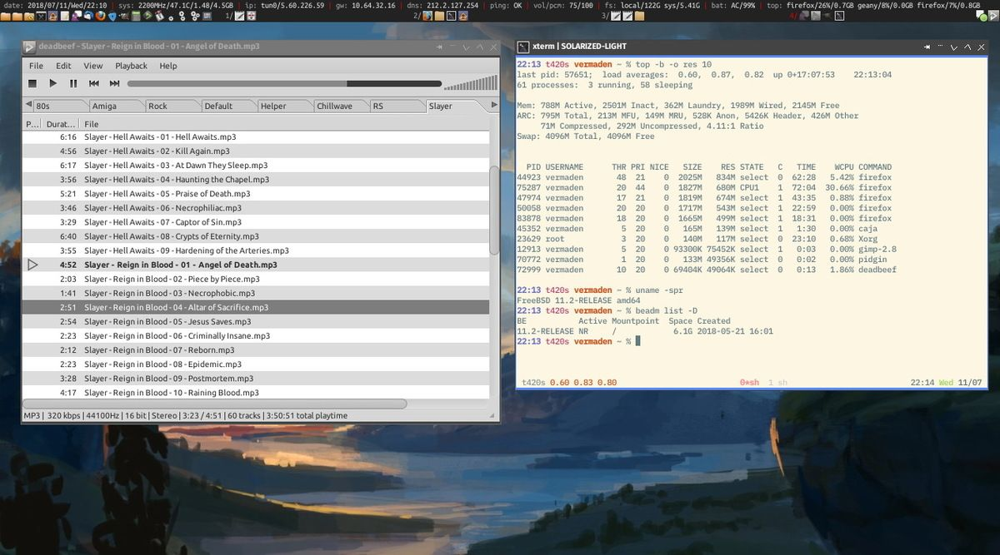

# Slawomir Wojciech Wojtczak (vermaden) runs FreeBSD

My first devices/computers/consoles (not at the same time) that I
remember were _Atari 2600_ and _Pegasus_ console which was hardware
clone of the _Nintendo NES_.

Back then I did not even knew that it was _Atari 2600_ as I referred
to it as _Video Computer System_ ... and I did not even knew any
English by then. It took me about two decades to get to know (by
accident) that this _Video Computer System_ was _Atari 2600_. :)

This equipment was used for playing computer games only.

Then I got _Amiga 600_ computer (or should I say my parents bought
it for me) which served both for playing computer games and also
other activities for the first time. Amiga is the computer that had
the greatest influence on me, as it was the first time I studied
the books about Amiga Workbench operating system and learned commands
from Amiga Shell terminal. I loved the idea of RAM Disk icon/directory
on the desktop that allowed me to transparently put any things in
system memory. I still miss that concept on today's desktop systems
... and I still remember how dismal I was when I watched _Amiga
Deathbed Vigil_ movie.

At the end of 1998 I got my first PC that of course came with Windows
and that computer served both as gaming machine and as well as a
typical tool. One time I dig into the internals with Windows Registry
(which left me disgusted by its concepts and implementation) and
its limited command line interface provided by `CMD.EXE` executable.
I remember that the heart of this box was not the CPU or the
motherboard but the graphics accelerator&mdash;the legendary _3Dfx
Voodoo_ card. This 3Dfx company&mdash;their attitude and
philosophy&mdash;also left solid fingerprint on my way. Like Amiga
did.

<!-- Hence how the top of my laptop looks like now. :) -->

Some games was even released as special edition with the only feature
being support for the 3Dfx Glide driver like _Need for Speed II:
Special Edition_.

After "migration" from Amiga to PC it never again "felt right". The
games were cool, but the Windows system was horrible. Time has
passed and different Windows versions and hardware modifications
took place. Windows XP felt really heavy at that time, not to mention
Windows 2000, for example, with even bigger hardware requirements.
I also don't understand all the hate about Windows ME. It crashed
with the same frequency as Windows 98 (or later Windows 98 Second
Edition), but maybe my hardware was different. :)

I don't have any of mine screenshots from that period as I lost all
my 40 GB (huge then) drive of data when I moved/resized the partition
with _Partition Magic_ to get some more space from the less filled
`C:` drive. That day I learned hard that "there are people who do
backups and people who will do backups". I never lost data again
as I had multiple copies of my data, but the same as _Netheril_
fall the lost data was gone forever.

I always followed various alternatives which led me to try Linux
in 2003, after reading about various distributions philosophies I
decided to run Slackware Linux with KDE 3. My buddy used Aurox
Linux by then (one of the few Linux distributions from Poland)
and encouraged me to do the same&mdash;especially in the context
of fixing possible problems as he already knew it and also as he
recently dumped Windows system. But Slackware sounded like a
better idea so I took that path instead. At first, I dual booted
between Windows XP and Slackware Linux, because I had everything
worked out on the Windows world while I often felt helpless in
the Linux world, so I would reboot into Windows to play some games
or find a solution for Linux problem if that was required. I remember
how strange the concept of dual clipboards (`PRIMARY` and `SECONDARY`)
was for me by then. I was amazed why "so much better" system as
Linux (at least marketed that way) needs a system tray program to
literally manage the clipboard. On Windows it was obvious, you do
`CTRL+C` to copy and `CTRL+V` to paste things, but on Linux there
(no I know its X11 feature) there were two clipboards that were
synchronized by this little system tray program from KDE 3. It
was also unthinkable for me that I will "lost" contents of last/recent
`CTRL+C` operation if I close the application from which the copy
was made. I settled down a little on Slackware, but not for long.
I really did not liked manual dependency management for packages,
for example. Also KDE 3 was really ugly and despite trying all
possible options I was not able to tweak it into something nice
looking.

After half a year on Slackware I checked other Linux distributions
again and decided to try Gentoo Linux. <!--I definitely agree
with the image below which visualizes Gentoo Linux experience,
especially when you install it for he first time. :)-->

Of course, I went with the most hardcore version with self building
`Stage 1` (compiler and toolchain) which was horrible idea at that
time because compilation on slow single core machine took forever
...  but after many hours I got Gentoo installed. I now have to
decide which desktop environment to use. I have read a lot of good
news about Fluxbox at that time so this is what I tried. It was
very weird experience (to create everything in GUI from scratch),
but very pleasant one. That recalled me the times of Amiga...
but Linux came in the way too much often. The more I dig into Gentoo
Linux the more I read that lots of Gentoo features are based on
[FreeBSD] solutions. Gentoo Portage is a clone of FreeBSD Ports.
That "central" /etc/rc.conf system configuration file concept was
taken from FreeBSD as well. So I started to gather information
about FreeBSD. The FreeBSD website (back then) and FreeBSD
Ports site (still) felt little outdated to say the least, but that
did not discouraged me.

Somewhere in 2005 I installed FreeBSD 5.4 on my computer. The
beginning was hard, like the earlier step with Gentoo, but similarly
like Gentoo the FreeBSD project came with a lot of great
documentation.  While Gentoo documentation is concentrated within
various Gentoo Wiki sites the FreeBSD project comes with
"official" documentation in the form of Handbook and FAQ. I
remember my first questions at the now nonexistent _BSDForums.org_
site&mdash;for example, one of the first ones&mdash;how to scroll
the terminal output in the plain console.  I now know that I had
to push `Scroll Lock` key, but it was something totally new for me.

<!--How BSDForums.org looked like.

This is the earliest screenshot I got from that period, and Gentoo
setup looked very similar. -->

Why [FreeBSD] and not [OpenBSD] or [NetBSD]? Probably because
Gentoo based most their concepts on the FreeBSD solutions, so
that led me to FreeBSD instead of the other BSD operating systems.
Currently I still use FreeBSD, but I keep an steady eye on the
OpenBSD, HardenedBSD, and DragonFly BSD solutions and
improvements.

As the migration path from Linux to FreeBSD is a lot easier&mdash;all
configuration files from `/home` can be just copied&mdash;the
migration was quite fast easy. I again had the Fluxbox configuration
which I used on the Gentoo. Now&mdash;on FreeBSD&mdash;it started
to fell even more like Amiga times. Everything is/has been well
thought and had its place and reason. The documentation was good
and the FreeBSD Community was second to none.

I even decided to upgrade the hardware to something more exotic. I
got _Gigabyte-GA-7DPXDW_ server motherboard with dual CPU
sockets&mdash;and as Athlon XP (desktop) processors were very easily
modified to "be" Athlon MP (server) ones I got also the second one
along with 1 GB of ECC RAM.

This dual CPU setup&mdash;quite unusual at these times&mdash;server
me very well. I switched from _Nvidia_ binary blob driver to software,
because Nvidia would break my uptime every several days. :)

I accumulated 30 days of uptime on that desktop box, not bad for a
system without any emergency UPS. :)

This was also the last time I used ECC RAM on FreeBSD (at least on
my boxes) while ZFS did not even existed on FreeBSD. :) But as time
flied I started to feel the need for something faster. As I also
got interested in Intel graphics card I got the new motherboard
with fastest Intel graphics card available then&mdash;as silly as
it sounds&mdash;the _Asus P5B-V_ with _Intel X3000 GMA_... and that
was a terrible idea, because FreeBSD graphics stack supported all
the Intel graphics cards instead of that one. At the beginning I
used software VESA driver, but the problem was not the performance
of the driver (as I also had quad core _Intel Q6600_ CPU), but the
screen resolution. As I got `1280x1024` screen by then using limited
`1024x768` was real PITA. I decided that I will try something else
then FreeBSD with _Intel X3000_ support finally arrives. I needed
to do something fast as I also needed to write my _Masters Thesis_
at that time.

That was in the middle of 2007. I wanted to try the other end of
the Linux distributions spectrum. Ubuntu. I could not go more
'desktop' way. :) It, of course, installed gently with GNOME 2
environment and `pulseaudio` already unfortunately existed. As I
preferred to run my computer all the time back then (I hadn't been
paying the electricity bills myself) there were several things that
annoyed my very much. For example, the mentioned `pulseaudio`&mdash;the
sound freezed after one-two days of using the computer (even if I
did not played any music or videos) and it stayed that way. I could
restart `pulseaudio` or reload the ALSA modules, but it stayed in
this _SUSFU_ state (situation unchanged still fucked up) until
reboot. As I needed to finish my _Masters Thesis_ I did not have
time to reinstall into something else as `pulseaudio` will be
probably similarly broken on other Linux distributions and FreeBSD
was still lacking the _Intel X3000 GMA_ support. Generally GNOME
2 experience was not bad but I really missed all my custom settings,
keyboard shortcuts, and customized behavior. I remained in pain on
the Ubuntu for two months&mdash;to the time I have finished my
_Masters Thesis_ about [Operating Systems'
Virtualization](https://toya.net.pl/~vermaden/tmp/thesis.pdf) which
you can download and read, but it's in Polish so use a translator,
if needed. :)

<!-- This is how Ubuntu looked back then. -->

I also had 'side' journey to the Mac wonderland as I
got opportunity to use _MacBook Pro_ with _Mac OS X Leopard_ for a year.
That allowed me to get real 'feel' of the Mac ecosystem
and their hardware (and philosophy) so I will not repeat same
stereotypes over and over again like a lot of anti-Apple people.
But after I switched back to FreeBSD system at work it just felt
better. I used `Terminal.app` on Mac a lot, but the xterm(1) on FreeBSD
just felt more natural.

What makes me laugh now that I created Mac styled Fluxbox themes
years till I got to run Mac and I still like Mac OS X look from the
Leopard times.

There was time on which I also played with _Solaris_ (and later
OpenSolaris). I must admit that there was time when Solaris so
called Java Desktop based on GNOME 2 was really looking good. It
was so good that only Mac OS X could only rival it for the best
looking os by then.

I really liked Solaris concepts and solutions like Zones and ZFS,
also Crossbow, Comstar or IPS (FreeBSD did not had _PNGng_ by then).
But I always got problem with 'desktop' software. While
I had everything in the FreeBSD Ports&mdash;almost the same amount
of applications that is available on Linux&mdash;there was always
some applications lacking in the Solaris world.

The Solaris 'journey' also left print on my soul so my
Fluxbox themes went into Solaris style. :)

After the Ubuntu fiasco I got other motherboard as FreeBSD still
did not supported _Intel GMA X3000_ card and settled in the FreeBSD
land again. What a relief it was after this `pulseaudio` nonsense.
In the meantime as I read a lot of good experiences about _Openbox_
I decided to try it out instead of Fluxbox. It was strange feeling
to mess with XML configuration files at the beginning but as I got
used to it and ordered the `rc.xml` and `menu.xml` configuration files
properly it was not a problem. Since then I used FreeBSD on different
machines including physical servers, virtual machines, and laptops.
I learned that adequately supported hardware is the most important
factor in FreeBSD ecosystem.

I still use Openbox and still use FreeBSD today and my desktop looks
like that one below.

After 15 years of using various Windows, UNIX
(macOS/AIX/HP-UX/Solaris/OpenSolaris/Illumos/FreeBSD/OpenBSD/NetBSD)
and Unix-like (Linux) systems I always come to conclusion that
FreeBSD is the system that sucks least. And sucks least with each
release and one day I will write why FreeBSD is such great operating
system... if I already haven't. :)

Find me on [Twitter], [Mastodon], or my site
[vermaden.wordpress.com](https://vermaden.wordpress.com). 
Or [contact me via email](vermaden@interia.pl).

_[8 Sep 2018](/raw/people/vermaden.md)_

---

P.S. Check out [the source of this story with more links and
images](https://vermaden.wordpress.com/2018/09/07/my-freebsd-story/).

[Twitter]: https://twitter.com/vermaden
[Mastodon]: https://bsd.network/@vermaden
[OpenBSD]: https://www.openbsd.org/
[FreeBSD]: https://www.freebsd.org/
[NetBSD]: https://www.netbsd.org/
